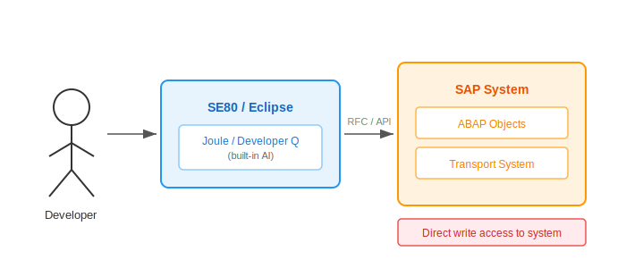
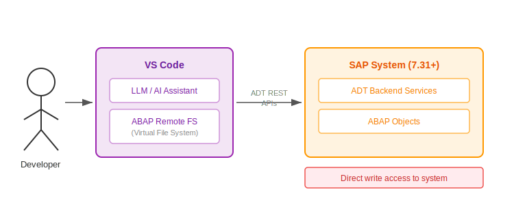
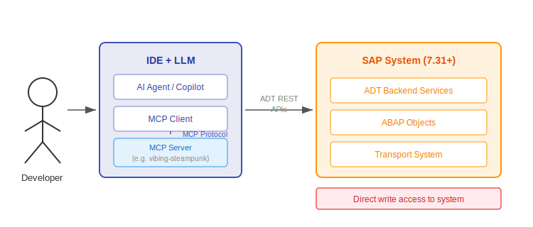
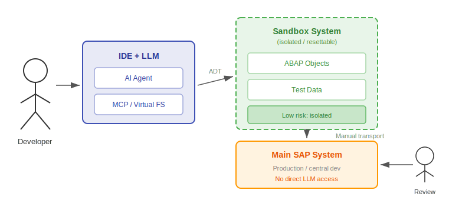
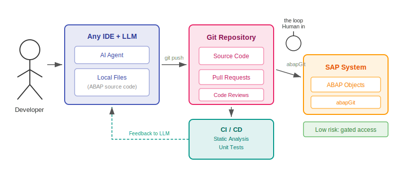
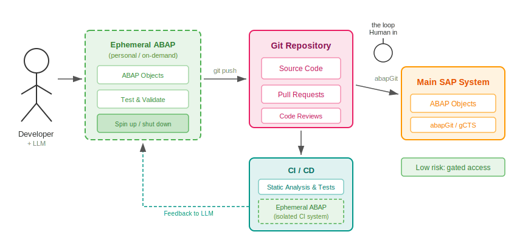

:plantuml-server-url: https://www.plantuml.com/plantuml
:source-highlighter: highlightjs

= Patterns for using LLMs in ABAP development
Lars Hvam, Heliconia Labs, March 2026
:numbered:

[cols="1,3",frame=none,grid=none]
|===
|Home
|link:https://github.com/heliconialabs/patterns-for-using-llms-in-abap-development[https://github.com/heliconialabs/patterns-for-using-llms-in-abap-development]

|License
|Creative Commons Attribution 4.0 International License

|Build
|{docdatetime}
|===

== Introduction

The world of AI is moving fast, SAP will be releasing their vscode extension in May 2026, easily enabling LLMs to connect to ABAP systems, and the patterns for using LLMs in ABAP development are still emerging.

This document is an attempt to give an overview of the different patterns, and tries to open and answer some questions regarding each pattern.

Contributions and feedback are very welcome, please open an issue or a pull request on the github repository.

Currently there is a lot of different tooling being built link:https://github.com/marianfoo/sap-ai-mcp-servers[SAP MCP Servers and SAP AI Skills] by link:https://www.linkedin.com/in/marianzeis/[Marian Zeis] gives a good overview.

On a general note, the patterns are not mutually exclusive, and can be combined in various ways. For example, you could have a sandbox system that is connected to an LLM via MCP, and then use git for version control and collaboration.

In an LLM implementation always start with getting the basics right, link:https://factory.ai/news/agent-readiness[Agent Readiness] and link:https://dora.dev/ai/[DORA AI] gives some suggestions on successful implementations.

== Patterns

=== SE80 / Eclipse

The LLM is embedded directly in the traditional ABAP development environment. The developer works within SE80 (the classic SAP GUI) or Eclipse-based ABAP Development Tools (ADT), and the AI assistant is tightly integrated as a built-in feature.

This is the simplest pattern to adopt, as it requires no additional tooling or infrastructure changes. Developers continue using their familiar environment, with AI capabilities layered on top.

The LLM has direct write access to the development system. Any code it generates or modifies is immediately active in the system — there is no intermediate step to review or gate changes before they are applied.

Examples: Kiro/Developer Q, Joule

=== Virtual File System via ADT

A VS Code extension exposes ABAP objects as a virtual file system, backed by ADT REST APIs. The developer works in VS Code, and the LLM sees ABAP source code as ordinary local files. Behind the scenes, reads and writes are translated into ADT calls against the live SAP system.

This gives the LLM a familiar file-based interface to ABAP code, making it straightforward to apply standard AI coding patterns without custom tooling. However, like the SE80/Eclipse pattern, the LLM writes directly to the live system — there is no gate between the AI and the development system.

Requires SAP NetWeaver 7.31 or higher with ADT backend services enabled.

Examples: link:https://marketplace.visualstudio.com/items?itemName=murbani.vscode-abap-remote-fs[ABAP remote filesystem]

=== Model Context Protocol via ADT

MCP (Model Context Protocol) is an open standard for connecting AI models to external data sources and tools. An MCP server bridges the AI agent and the SAP system by translating MCP tool calls into ADT REST API requests. The LLM can call tools to read and write ABAP objects, check syntax, execute reports, and more.

Compared to the Virtual File System pattern, MCP gives the agent a richer and more structured interface. The LLM does not just see files — it has named tools with defined inputs and outputs, making it better suited for autonomous agent workflows where the LLM decides what to do next.

Like the Virtual FS pattern, MCP via ADT requires SAP NetWeaver 7.31 or higher, and the LLM still has direct write access to the development system.

Examples: link:https://github.com/oisee/vibing-steampunk[vibing-steampunk]

=== Sandboxed

Instead of connecting the LLM to the central development system, the LLM is given access to a dedicated sandbox system. The sandbox is isolated from the main system, so the LLM can read, write, and experiment freely without risking stability, data integrity, or transport locks in the central development system.

LLMs connect to the sandbox via MCP or a virtual file system. Changes that pass review are transported to the main system manually by a human.

Each developer can have their own sandbox system, or there can be a shared sandbox system for the team. The sandbox system can be reset to a known state if something goes wrong. However, this pattern requires additional infrastructure and maintenance overhead to manage the sandbox systems.

Examples: link:https://www.linkedin.com/pulse/coding-agents-abap-source-codes-jakub-fil%C3%A1k-ym8gf/[Coding Agents with ABAP source codes] - Jakub Filák

=== Git / Off-Stack

In this pattern, ABAP source code lives in a git repository as plain files. The LLM works on local files in any editor, pushes changes to git, and abapGit synchronizes the repository into the SAP system. The LLM never touches the SAP system directly.

The key insight is that git should not be introduced solely to enable LLMs. Choose git for version control, code reviews, and collaboration — the LLM then operates naturally within that existing workflow. This gives access to the full ecosystem of git tooling, CI/CD pipelines, and industry-standard practices that many non-SAP teams already know.

A CI pipeline runs on every commit or pull request, executing static analysis and unit tests and feeding the results back to the developer and the LLM. This loop allows the LLM to self-correct before code reaches the central system. A human reviews and approves pull requests, acting as the gate between AI-generated code and the development system.

abapGit is open source and fully extensible — it can be adapted to support custom object types, adjusted to fit specific workflows, or integrated into automated pipelines. abapGit is battle-tested over more than ten years across many SAP systems.

Another possibility for the future is having preview deployments, where each branch or pull request gets deployed to a temporary environment for testing before merging into the main branch.

Static analysis can be done with abaplint providing feedback to the LLM on code quality, security issues, and best practices. Unit tests can be executed in open-abap or via an ephemeral ABAP system.

Examples: Any editor, abapGit

=== Decentral development with ephemeral ABAP systems

This pattern is a combination of sandbox and git. This setup is known from almost all other languages where developers usually write code
on their personal workstation and they deliver the changes by pushing to a remote git repository (let's ignore the other version control systems).
Unfortunately, ABAP does not have an official runtime which fully supports entire ABAP syntax and that can be executed on a regular developer
machine, so this pattern expects it is possible to quickly deploy a personal/team/project based ABAP system which lives for few hours or few
days and can be shut down when nobody is using it (running 9/5 instead of 24/7).

In this pattern, it is expected that developers can work with mock test data and other resources. It is expected that developers can automate
system configuration, so when they get a new system, they do not spend days pushing the right customization.

In this pattern, developers can do whatever branching strategy they want but they usually follow GitHub Pull request style with
a short lived branches merged into the main branch after CI and code review.

In this pattern, CI uses another ephemeral ABAP system where the changes get tested in an isolated environment. It is possible because
developers already automated their setup, write modularized code and uses test doubles.

In this pattern, LLMs can do whatever they realize they should do because whatever happens in these systems, stays in the system
or in the worst case a invalid change reaches git. If something invalid reaches git, CI will most probably catch it. And even CI does not
catch invalid change, there is still a chance the human reviewer (or another LLM) will catch it while reviewing the change.

== Summary

[cols="2,1,1,1,1,1",options="header",frame=all,grid=all]
|===
|Pattern |Autonomous |Cost |Risk |Version required |Object types

|SE80 / Eclipse
|No
|$
|High
|Any
|Any

|Virtual FS
|No
|$
|High
|7.31+
|ADT

|MCP
|No
|$
|High
|7.31+
|ADT

|Sandboxed
|Possible
|$$$
|Low
|Any
|ADT

|Git / Off-Stack
|Yes
|$$
|Low
|7.02+
|abapGit

|Decentral development
|Yes
|\$$$$
|Low
|Any
|Any
|===

Combinations and nuances of above. Take care and consider risks.

Fully autonomous operation is of course possible by adding SAP systems so each commit or developer has a system, which also mitigates risk, but increases cost.

Recommend designing and choosing patterns which can make the agents run fully autonomously, but start with patterns which are less risky and costly, and then evolve towards more autonomy as you gain experience and confidence.

High risk assuming the LLM can write to the main development system, which can lead to unintended consequences, such as code changes that break the system, security vulnerabilities, or data loss.

#keepTheCoreMoving

== Broader Impact

The adoption of LLMs in software development brings real benefits, but it also carries risks that extend beyond the individual team or system. These are worth naming directly.

=== Job displacement

LLMs increase developer productivity significantly. At scale, this reduces the number of developers needed to maintain and evolve ABAP systems. For individuals, this may mean role changes, reduced demand for certain skills, or job loss. Organizations should be deliberate about how they communicate and manage this transition rather than treating it as a side effect.

=== Concentration of expertise

When LLMs handle routine coding tasks, developers interact less with the underlying code. Over time, deep ABAP knowledge may concentrate in fewer people, or be lost entirely as teams shrink and institutional knowledge is not passed on. Systems become harder to understand and audit when no human has read the code carefully.

=== Code quality and security

LLMs generate plausible-looking code that may contain subtle bugs, logic errors, or security vulnerabilities. In ABAP systems that process business-critical data — finance, payroll, supply chain — a mistake can have serious consequences. Automated review and testing reduce this risk but do not eliminate it. LLM-generated code should be held to the same standards as human-written code.

=== Energy consumption

Training and running large language models consumes significant energy. At the scale of an enterprise or a platform vendor, the aggregate cost is not trivial. This is a shared industry challenge, not unique to ABAP, but it is worth factoring into decisions about how extensively LLMs are deployed.

=== Vendor lock-in

Relying on a single LLM provider or tightly integrated tool (e.g., a vendor-supplied copilot) introduces dependency on that vendor's pricing, availability, and terms. Patterns that keep the LLM loosely coupled — such as Git / Off-Stack — preserve more flexibility to swap providers or tooling as the market evolves.